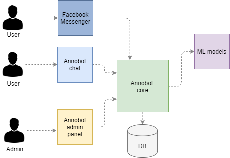
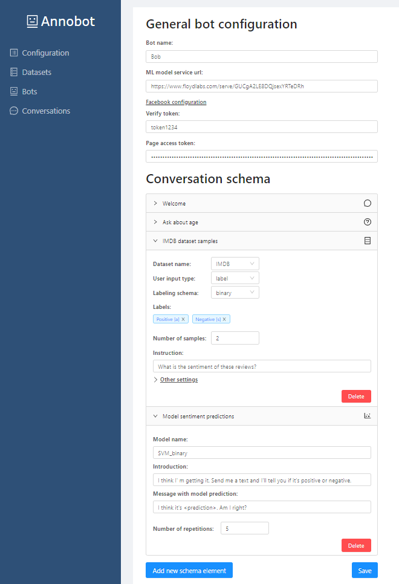
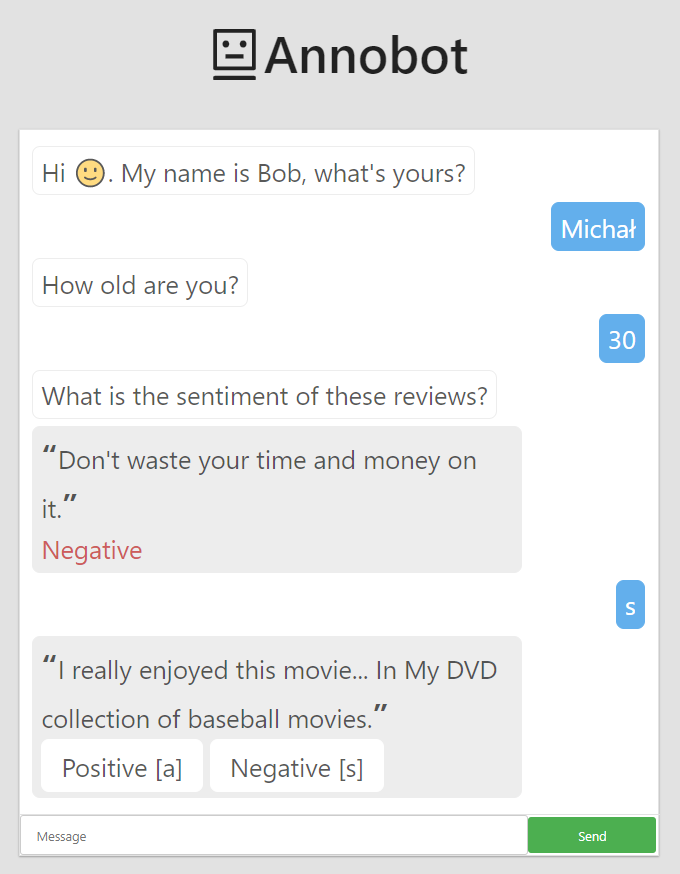
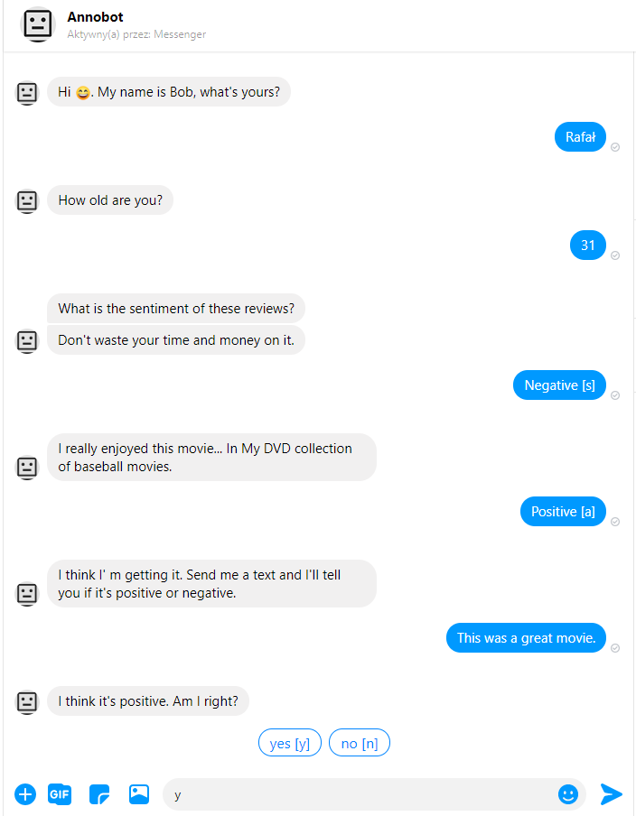

# Annobot

The Annobot platform is the first open-sourced platform for annotating and creating datasets through conversation with a chatbot.

### !!! The system is in the prototype phase. More detailed information and instructions on how to run the application to be available to the world will be available as soon as possible !!!

### 1. Functionalities

- Annotating through conversation with a chatbot.
- Pre-annotation.
- Active sampling.
- Online learning.
- Real-time inter-annotator agreement.
- Integration with Facebook Messenger.

### 2. Demo

https://annobot.herokuapp.com/#/chat/Bob

### 3. Architecture

### 4. Annobot screenshots

### 5. Installation

#### 5.1 Database

The first step is to install PostgreSQL database, which can be downloaded [here](https://www.postgresql.org/download/). Then you have to run the scripts that create the schemes and tables available in the [database/schema](database/schema) directory.

#### 5.2 Configuration
In this step you need to modify [application.json](app-monolith/src/main/resources/application.yml) file by entering the address of the created database and the database user's login/password.

#### 5.3 Running Annobot server
In main directory run mvn clean package and then you can run main class [AnnobotApplication](app-monolith/src/main/java/com/annobot/AnnobotApplication.java).

#### 5.4 Running Annobot admin panel and Annobot chat
Go to [client](client) directory and run npm install and npm start.
